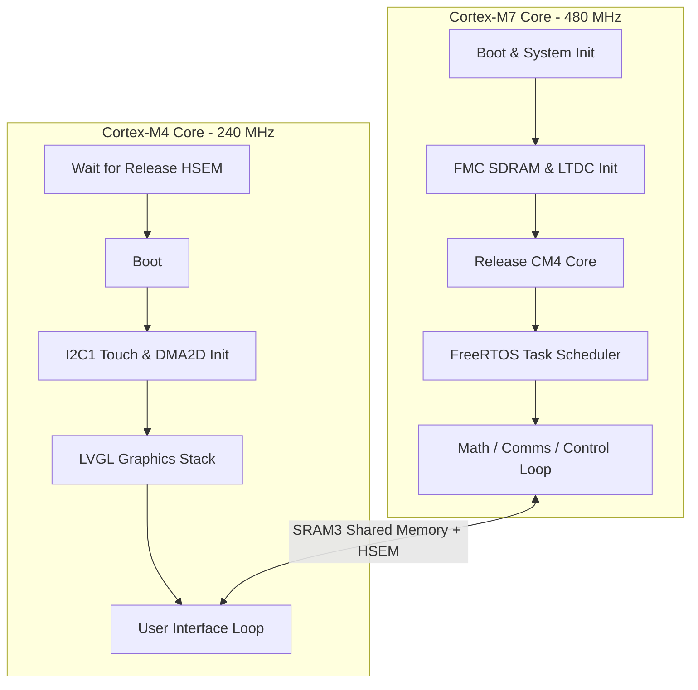

# Project Template Architecture — Dual-Core STM32H757

This document explains the architecture of the **Riverdi STM32H7 7" Dual-Core template project**. It details the division of labor between the two cores, directory structure, memory mapping, and IPC (Inter-Processor Communication) design.

---

## 1 — Decoupled Core Responsibilities

The STM32H757 features two asymmetrical cores: a Cortex-M7 (CM7) running at 480 MHz and a Cortex-M4 (CM4) running at 240 MHz. In this template, they are decoupled as follows:



### Cortex-M7 (CM7) — Calculations & Communications
The CM7 acts as the master processor. Its primary duties include:
- Configuring system clocks and power domains.
- Initializing external hardware peripherals like **FMC (SDRAM)** and **LTDC (LCD controller)**.
- Synchronizing the boot sequence: CM7 keeps CM4 in deep sleep, initializes external SDRAM, and then releases CM4 to prevent bus contentions.
- Hosting **FreeRTOS** to handle real-time calculation loops, sensor telemetry, and industrial communication protocols (Modbus, FDCAN, SPI, USART).

### Cortex-M4 (CM4) — Dedicated HMI Graphics
The CM4 acts as a slave processor dedicated entirely to the user interface:
- Booting up after receiving the wake-up signal from CM7.
- Initializing touchscreen peripherals (I2C1 controller).
- Initializing the **DMA2D (Chrom-ART)** graphics accelerator.
- Initializing the **LVGL** graphical library, drawing a dark blue background with the centered label `"TWERD ENERGO-PLUS"`.
- Running the UI refresh loop and handling touchscreen tap events.

---

## 2 — Directory Structure

The repository splits code from build/configuration folders:

```
├── CM4/                  # Cortex-M4 Core C/C++ source code
│   └── Core/
│       ├── Inc/          # Header files (main.h, etc.)
│       └── Src/          # Source files (main.c, lvgl_port_touch.c)
│
├── CM7/                  # Cortex-M7 Core C/C++ source code
│   ├── Core/             # Core code (main.c, freertos.c)
│   └── FATFS/            # FatFS filesystem layer
│
├── Common/               # Code shared between both CM4 and CM7 cores
│   ├── Src/              # Shared source files (CMSIS system boot files)
│   └── shared_memory.h   # IPC shared memory buffers & semaphores
│
├── Middlewares/          # Third-party libraries (LVGL, FreeRTOS, FatFS)
│
├── STM32CubeIDE/         # Eclipse IDE project descriptors & makefiles
│   ├── CM4/              # IDE config & linker script (.ld) for CM4
│   │   └── Release/      # CM4 build outputs & autogenerated makefiles
│   └── CM7/              # IDE config & linker script (.ld) for CM7
│       └── Release/      # CM7 build outputs & autogenerated makefiles
│
├── Dockerfile            # GCC toolchain compiler container configuration
└── docker-compose.yml    # Build service mounts and commands
```

---

## 3 — Inter-Processor Communication (IPC)

Peripherals and memory regions are shared between both cores.

### Shared SRAM3 Memory
To send calculations from CM7 to CM4 (and screen events from CM4 to CM7), we use **SRAM3 (D2 domain)** which is visible to both cores.
* **Base Address**: `0x30040000`
* **Buffer Definition**: Located in [Common/shared_memory.h](file:///home/alex/Documents/riverdi/LVGL_Demo_H7-H4_switch/lv_port_riverdi_70-stm32h7/Common/shared_memory.h).

```c
typedef struct {
  /* Solar/Telemetry (Written by CM7, Read by CM4) */
  float pv_voltage;
  float pv_current;
  float bat_soc;
  
  /* Settings (Written by CM4 UI, Read by CM7 calculations) */
  uint16_t config_grid_voltage;
  uint16_t config_grid_freq;
} SharedBuffer_t;

#define SHARED_BUFFER   ((volatile SharedBuffer_t *)0x30040000)
```

### Hardware Semaphores (`HSEM`)
To prevent read-write race conditions when both cores access the shared memory buffer, we use the STM32 hardware semaphore module:
* **`HSEM_ID_SHARED_MEM` (Semaphore ID 1)** is taken before reading/writing to SRAM3, and released immediately after.

```c
if (HAL_HSEM_Take(HSEM_ID_SHARED_MEM, 0) == HAL_OK) {
    SHARED_BUFFER->pv_voltage = get_adc_voltage();
    HAL_HSEM_Release(HSEM_ID_SHARED_MEM, 0);
}
```

---

## 4 — How to Build & Flash (Quick Guide)

See [Docs/Build_and_Flash_CLI.md](file:///home/alex/Documents/riverdi/LVGL_Demo_H7-H4_switch/lv_port_riverdi_70-stm32h7/Docs/Build_and_Flash_CLI.md) for full commands.

| Action | CLI Command | VS Code Task |
|---|---|---|
| **Clean All** | `docker compose run --rm builder make clean` | `Docker: Clean` |
| **Compile All** | `docker compose run --rm builder make all` | `Docker: Build All (CM4 + CM7)` |
| **Flash Board** | `STM32_Programmer_CLI -c port=SWD -w <hex_paths> -rst` | `Flash: Both (CM7 then CM4 + reset)` |
