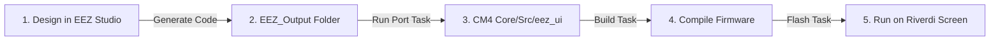

# UI Developing Pipeline — EEZ Studio to STM32H7

This document describes the workflow for designing user interfaces visually inside **EEZ Studio** and compiling/flashing them onto the Cortex-M4 (CM4) core of the STM32H757.

---

## Workflow Overview

The development loop is fully automated:



---

## Step-by-Step Pipeline

### Step 1 — Design the UI in EEZ Studio
1. Open your EEZ Studio project (e.g. `ui.eez`).
2. Design screens, styles, widgets, themes, and animations.
3. In EEZ Studio **Project Settings** (under the Code Generation settings tab):
   - Set **Target** to `LVGL`.
   - Set **LVGL Version** to `v8.3.11`.
   - Set the **Output Directory** to a folder named `EEZ_Output` inside this project's root directory.

### Step 2 — Generate Code from EEZ Studio
1. Click **Generate Code** (or press `Ctrl+Shift+G` in EEZ Studio).
2. EEZ Studio will write all `.c` and `.h` assets (ui screens, variables, custom fonts, images) into the `EEZ_Output/` directory.

### Step 3 — Port Code to Firmware
Run the porting script to transfer the files and automatically configure build paths:
* **VS Code Task**: In VS Code Task Explorer, run the **`EEZ: Port UI Output`** task.
* **CLI alternative**: Run the python script directly from the project root:
  ```bash
  python3 port_eez_ui.py
  ```

> [!NOTE]
> **What this script does behind the scenes:**
> 1. Clears `CM4/Core/Src/eez_ui/` and copies all generated `.c`/`.h` files flat.
> 2. Regenerates `subdir.mk` with explicit GCC build rules for all copied files.
> 3. Registers all object files dynamically in CM4's `objects.list`.
> 4. Updates include paths in the `.project` and `.cproject` files so that the IDE automatically imports and compiles the new code.

### Step 4 — Compile and Flash
1. Run the **`Docker: Build CM4`** or **`Docker: Build All`** task.
2. Run the **`Flash: Both (CM7 then CM4 + reset)`** task to upload the updated firmware to the board.

---

## Connecting UI Events to C Logic

EEZ Studio allows you to define **Actions** (callbacks) for buttons, sliders, list-views, etc. When code is generated, EEZ Studio generates function declarations for these callbacks (e.g., in `ui.h`).

To implement your custom control logic:
1. Create a custom logic file (e.g., `CM4/Core/Src/ui_callbacks.c`).
2. `#include "ui.h"` and implement the callback functions generated by EEZ Studio.
3. Because `ui_callbacks.c` is outside the `eez_ui/` folder, it will **never be overwritten** when you run the porting script!

#### Example Callback Implementation (`ui_callbacks.c`):
```c
#include "ui.h"
#include "shared_memory.h"

/* Action callback defined in EEZ Studio for a button */
void ui_action_toggle_inverter_power(void) {
    // Write configuration to shared memory for Cortex-M7 to process
    if (HAL_HSEM_Take(HSEM_ID_SHARED_MEM, 0) == HAL_OK) {
        SHARED_BUFFER->inverter_enabled = !SHARED_BUFFER->inverter_enabled;
        HAL_HSEM_Release(HSEM_ID_SHARED_MEM, 0);
    }
}
```
