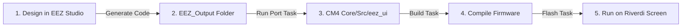

# UI Developing Pipeline — EEZ Studio to STM32H7

This document describes the workflow for designing user interfaces visually inside **EEZ Studio** and compiling/flashing them onto the Cortex-M4 (CM4) core of the STM32H757.

---

## Workflow Overview

The development loop is fully automated:



---

## Step-by-Step Pipeline

### Step 1 — Design the UI in EEZ Studio
1. Open the project inside **EEZ Studio** (located at [EEZ/Riverdi-template/Riverdi-template.eez-project](../EEZ/Riverdi-template/Riverdi-template.eez-project)).
2. In EEZ Studio **Project Settings** (under the General and Code Generation tabs):
   - **Target**: `LVGL`
   - **LVGL Version**: `8.3` (or `8.4`)
   - **Output Directory**: Point it directly to `CM4/Core/Src/eez_ui` (configured as `../../CM4/Core/Src/eez_ui` in project settings).

### Step 2 — Generate Code from EEZ Studio
1. Click **Generate Code** (or press `Ctrl+Shift+G` in EEZ Studio).
2. EEZ Studio will generate all `.c` and `.h` assets directly into [CM4/Core/Src/eez_ui](../CM4/Core/Src/eez_ui).

### Step 3 — Compile and Flash (Auto-Ported!)
There is **no manual porting step** needed anymore!
1. Run the **`Docker: Build CM4`** or **`Docker: Build All`** task.
   > [!NOTE]
   > The build system automatically detects the new files, updates the build makefiles, and compiles everything in a single step!
2. Run the **`Flash: Both (CM7 then CM4 + reset)`** task to upload the updated firmware to the board.

---

## Updating HMI Widgets from Control Data (Cortex-M7)

Since this board is configured for a **non-touch screen**, the display operates as a status dashboard/telemetry viewer. Interaction occurs by reading variables from the shared memory block and updating the LVGL widgets accordingly.

To connect your shared control data to the visual widgets:
1. Inside your CM4 main loop (or a dedicated UI update task), take the hardware semaphore to safely read variables from `SHARED_BUFFER`.
2. Map these values to the generated widgets (e.g. using `lv_label_set_text_fmt`).

#### Example Status Update Implementation (`main.c` / CM4):
```c
#include "ui.h"
#include "shared_memory.h"
#include "lvgl/lvgl.h"

void update_ui_telemetry(void) {
    if (HAL_HSEM_Take(HSEM_ID_SHARED_MEM, 0) == HAL_OK) {
        // Read data computed by Cortex-M7
        float pv_voltage = SHARED_BUFFER->pv_voltage;
        float pv_current = SHARED_BUFFER->pv_current;
        float bat_soc = SHARED_BUFFER->bat_soc;

        HAL_HSEM_Release(HSEM_ID_SHARED_MEM, 0);

        // Update LVGL UI label widgets format
        // (Assuming objects 'ui_lbl_pv_voltage', 'ui_lbl_bat_soc' etc are defined in your EEZ project)
        if (ui_lbl_pv_voltage) {
            lv_label_set_text_fmt(ui_lbl_pv_voltage, "%.1f V", pv_voltage);
        }
        if (ui_lbl_bat_soc) {
            lv_label_set_text_fmt(ui_lbl_bat_soc, "%.0f%%", bat_soc);
        }
    }
}
```
