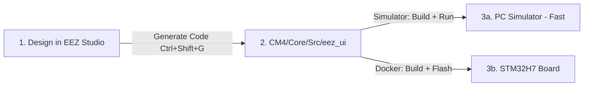

# UI Developing Pipeline — EEZ Studio → STM32H7 (with PC Simulator)

This document describes the workflow for designing user interfaces visually inside **EEZ Studio** and iterating on them — either quickly on the **PC Simulator** or by compiling/flashing them onto the Cortex-M4 (CM4) core of the STM32H757.

---

## Workflow Overview

The development loop has two fast-feedback targets:



---

## Step-by-Step Pipeline

### Step 1 — Design the UI in EEZ Studio

1. Open the EEZ project: `EEZ/Riverdi-template/Riverdi-template.eez-project`
2. Verify **Project Settings → Code Generation**:
   - **Target**: `LVGL`
   - **LVGL Version**: `8.3`
   - **Output Directory**: `../../CM4/Core/Src/eez_ui`
3. Make your UI changes (screens, widgets, variables, events).

### Step 2 — Generate Code

Press **`Ctrl+Shift+G`** in EEZ Studio.

EEZ writes all `.c` / `.h` sources directly into `CM4/Core/Src/eez_ui`. The files are immediately ready for both the simulator and the ARM build — no extra porting step required.

> [!NOTE]
> The legacy `port_eez_ui.py` script is only needed if EEZ was configured to output to a different folder (e.g. `EEZ_Output/`). With the output path set directly to `CM4/Core/Src/eez_ui` you can skip it entirely.

---

## Step 3a — Run on the PC Simulator ✅ Recommended First Step

The PC simulator compiles the exact same EEZ-generated C code with SDL2, opening a **1024×600 pixel window** on your Linux desktop — no hardware required.

### Prerequisites (one-time host setup)

```bash
sudo apt-get install libsdl2-dev
```

### Build the simulator

Run the VS Code task **`Simulator: Build (Docker)`**, or from a terminal:

```bash
cd lv_port_riverdi_70-stm32h7
export UID GID=$(id -g)
docker compose run --rm builder bash -c \
    'cmake -B pc_simulator/build -S pc_simulator && make -C pc_simulator/build -j$(nproc)'
```

### Run the simulator

Run the VS Code task **`Simulator: Run (Host)`**, or:

```bash
./pc_simulator/build/lvgl_simulator
```

Or use the combined task **`Simulator: Build & Run`** to build and launch in one shot.

### Keyboard Controls

| Key | Action |
|-----|--------|
| `↑` Arrow Up | Move focus to previous item |
| `↓` Arrow Down | Move focus to next item |
| `←` Arrow Left | Collapse group / move focus left |
| `→` Arrow Right | Expand group / move focus right |
| `Enter` | Select / confirm focused item |
| `Escape` | Back / cancel |
| Close Window | Quit simulator |

---

## Step 3b — Compile and Flash to Hardware

Once the UI looks correct in the simulator, build and flash to the real board.

### Build (Docker)

Run **`Docker: Build CM4`** or **`Docker: Build All (CM4 + CM7)`**, or:

```bash
docker compose run --rm builder make cm4
```

> [!NOTE]
> The Makefile automatically picks up all source files in `CM4/Core/Src/eez_ui`.

### Flash

Run **`Flash: Both (CM7 then CM4 + reset)`** to program both cores via ST-Link and reset the board.

---

## Updating HMI Widgets from Telemetry Data

Since this board uses a **non-touch screen**, the display operates as a telemetry dashboard. The Cortex-M7 writes live process data into shared SRAM3; the CM4 reads it and updates LVGL widgets.

Inside your CM4 main loop (or a dedicated UI update task):

```c
#include "ui.h"
#include "shared_memory.h"
#include "lvgl/lvgl.h"

void update_ui_telemetry(void) {
    if (HAL_HSEM_Take(HSEM_ID_SHARED_MEM, 0) == HAL_OK) {
        float pv_voltage = SHARED_BUFFER->pv_voltage;
        float bat_soc    = SHARED_BUFFER->bat_soc;
        HAL_HSEM_Release(HSEM_ID_SHARED_MEM, 0);

        if (ui_lbl_pv_voltage)
            lv_label_set_text_fmt(ui_lbl_pv_voltage, "%.1f V", pv_voltage);

        if (ui_lbl_bat_soc)
            lv_label_set_text_fmt(ui_lbl_bat_soc, "%.0f%%", bat_soc);
    }
}
```

> [!NOTE]
> The PC Simulator uses a mock `SharedBuffer_t` pre-populated with realistic demo values (see `pc_simulator/pc_simulator_hw.c`), so widget bindings can be validated without hardware.

---

## VS Code Task Summary

| Task | Action |
|------|--------|
| `Simulator: Build (Docker)` | Compile the SDL2 simulator binary inside Docker |
| `Simulator: Run (Host)` | Launch the 1024×600 simulator window on the desktop |
| `Simulator: Build & Run` | Build then immediately launch (one shot) |
| `Simulator: Clean` | Remove `pc_simulator/build/` |
| `Docker: Build CM4` | Compile Cortex-M4 firmware |
| `Docker: Build CM7` | Compile Cortex-M7 firmware |
| `Docker: Build All (CM4 + CM7)` | Compile both cores simultaneously |
| `Docker: Clean` | Clean all ARM build outputs |
| `Flash: CM4` | Flash CM4 firmware via ST-Link |
| `Flash: CM7` | Flash CM7 firmware via ST-Link |
| `Flash: Both (CM7 then CM4 + reset)` | Flash both cores and reset the board |
