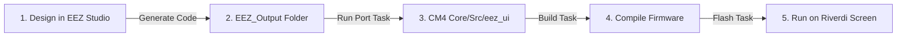

# UI Developing Pipeline — EEZ Studio to STM32H7

This document describes the workflow for designing user interfaces visually inside **EEZ Studio** and compiling/flashing them onto the Cortex-M4 (CM4) core of the STM32H757.

---

## Workflow Overview

The development loop is fully automated:



---

## Step-by-Step Pipeline

### Step 1 — Design the UI in EEZ Studio
1. Open the project inside **EEZ Studio** (located at [EEZ/Riverdi-template/Riverdi-template.eez-project](file:///home/alex/Documents/riverdi/LVGL_Demo_H7-H4_switch/lv_port_riverdi_70-stm32h7/EEZ/Riverdi-template/Riverdi-template.eez-project)).
2. In EEZ Studio **Project Settings** (under the General and Code Generation tabs):
   - **Target**: `LVGL`
   - **LVGL Version**: `8.3` (or `8.4`)
   - **Output Directory**: Point it directly to `CM4/Core/Src/eez_ui` (configured as `../../CM4/Core/Src/eez_ui` in project settings).

### Step 2 — Generate Code from EEZ Studio
1. Click **Generate Code** (or press `Ctrl+Shift+G` in EEZ Studio).
2. EEZ Studio will generate all `.c` and `.h` assets directly into [CM4/Core/Src/eez_ui](file:///home/alex/Documents/riverdi/LVGL_Demo_H7-H4_switch/lv_port_riverdi_70-stm32h7/CM4/Core/Src/eez_ui).

### Step 3 — Compile and Flash (Auto-Ported!)
There is **no manual porting step** needed anymore!
1. Run the **`Docker: Build CM4`** or **`Docker: Build All`** task.
   > [!NOTE]
   > The build system automatically detects the new files, updates the build makefiles, and compiles everything in a single step!
2. Run the **`Flash: Both (CM7 then CM4 + reset)`** task to upload the updated firmware to the board.

---

## Connecting UI Events to C Logic

EEZ Studio allows you to define **Actions** (callbacks) for buttons, sliders, list-views, etc. When code is generated, EEZ Studio generates function declarations for these callbacks (e.g., in `ui.h`).

To implement your custom control logic:
1. Create a custom logic file (e.g., `CM4/Core/Src/ui_callbacks.c`).
2. `#include "ui.h"` and implement the callback functions generated by EEZ Studio.
3. Because `ui_callbacks.c` is outside the `eez_ui/` folder, it will **never be overwritten** when you run the porting script!

#### Example Callback Implementation (`ui_callbacks.c`):
```c
#include "ui.h"
#include "shared_memory.h"

/* Action callback defined in EEZ Studio for a button */
void ui_action_toggle_inverter_power(void) {
    // Write configuration to shared memory for Cortex-M7 to process
    if (HAL_HSEM_Take(HSEM_ID_SHARED_MEM, 0) == HAL_OK) {
        SHARED_BUFFER->inverter_enabled = !SHARED_BUFFER->inverter_enabled;
        HAL_HSEM_Release(HSEM_ID_SHARED_MEM, 0);
    }
}
```
