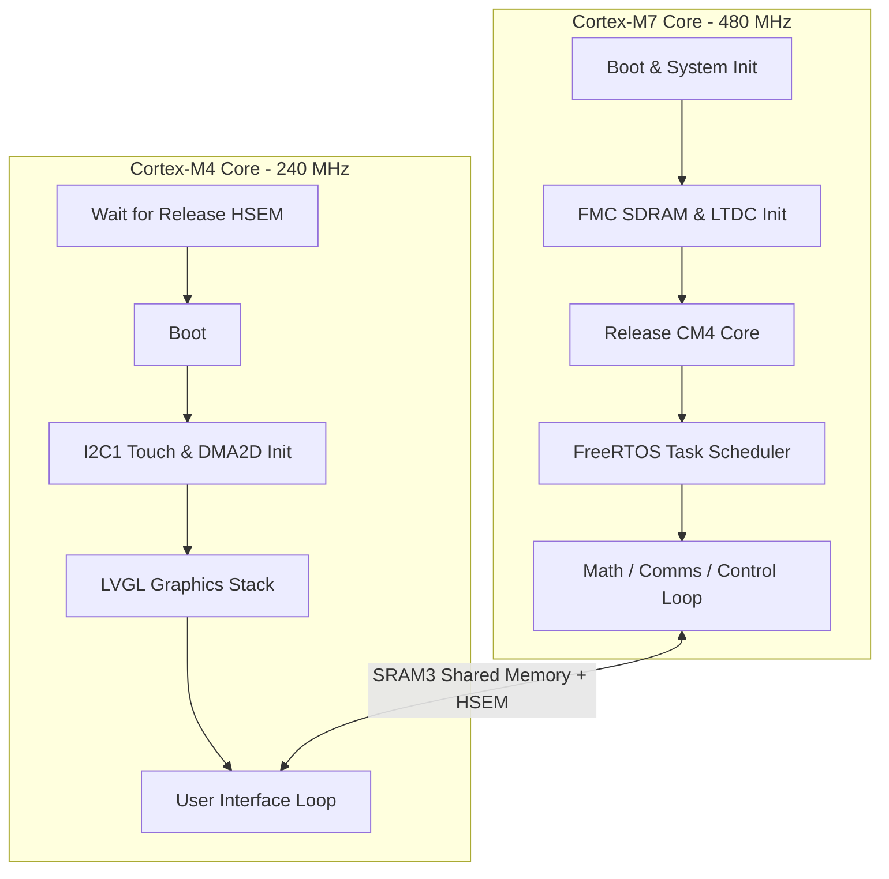
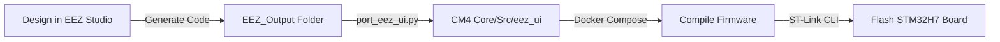

# Riverdi STM32H7 7.0” Dual-Core LVGL & EEZ HMI Template

This repository is a premium, fully-decoupled **Dual-Core HMI template project** for the **Riverdi STM32 Embedded 7.0” Displays** (powered by the dual-core **STM32H757XIH6** MCU).

It decouples HMI rendering from main system tasks:
- **Cortex-M7 (480 MHz)**: Reserved exclusively for calculations, RTOS scheduler, communications, and background control loops.
- **Cortex-M4 (240 MHz)**: Dedicated entirely to visual rendering (LVGL graphics engine, DMA2D Chrom-ART acceleration, and touch panel polling).

---

## 🏗️ Dual-Core Decoupled Architecture

The template isolates visual cycles to guarantee deterministic performance for time-critical calculations and communications on the Cortex-M7:



### Inter-Processor Communication (IPC)
* **Shared SRAM3 Memory (`0x30040000`)**: Memory block visible to both cores used to exchange telemetry (M7 $\rightarrow$ M4) and user events (M4 $\rightarrow$ M7). Defined in [Common/shared_memory.h](file:///home/alex/Documents/riverdi/RIVERDI_LVGL_TWERD_TEMPLATE/lv_port_riverdi_70-stm32h7/Common/shared_memory.h).
* **Hardware Semaphores (`HSEM`)**: Prevent read-write race conditions when both cores access the shared buffer (`HSEM_ID_SHARED_MEM` / Semaphore ID 1).

---

## ⚙️ Hardware Specifications

| Component | Specification | Details |
|---|---|---|
| **MCU** | STM32H757XIH6 | Asymmetric dual-core: Cortex-M7 (480MHz) + Cortex-M4 (240MHz) |
| **RAM** | 9 MB | 1 MB internal SRAM + 8 MB external SDRAM (32-bit bus width) |
| **Flash** | 66 MB | 2 MB internal + 64 MB external QSPI flash |
| **Graphics Accelerator** | Chrom-ART (DMA2D) | Used by CM4 for high-speed hardware-accelerated GUI blitting |
| **Display Panel** | 7.0" IPS TFT LCD | Resolution: **1024x600**, 170 DPI, 24-bit color depth |
| **Touch Pad** | Capacitive | Connected via I2C1 touch controller |
| **Interfaces** | Industrial standard | 2x CAN FD, RS485, RS232, USB, expansion headers |

### Supported Displays & Purchase Links
* [RVT70HSSNWC00-B](https://riverdi.com/product/7-inch-lcd-display-capacitive-touch-panel-optical-bonding-uxtouch-stm32h7-rvt70hssnwc00-b/) — *Capacitive Touch, Optical Bonding*
* [RVT70HSSNWC00](https://riverdi.com/product/7-inch-lcd-display-capacitive-touch-panel-air-bonding-uxtouch-stm32h7-rvt70hssnwc00/) — *Capacitive Touch, Air Bonding*
* [RVT70HSSFWCA0](https://riverdi.com/product/7-inch-lcd-display-capacitive-touch-panel-air-bonding-atouch-frame-stm32h7-rvt70hssfwca0/) — *Capacitive Touch with Frame, aTouch*
* [RVT70HSSNWCA0](https://riverdi.com/product/7-inch-lcd-display-capacitive-touch-panel-air-bonding-atouch-stm32h7-rvt70hssnwca0/) — *Capacitive Touch, aTouch*
* [RVT70HSSFWN00](https://riverdi.com/product/7-inch-lcd-display-stm32h7-frame-rvt70hssfwn00/) — *Non-touch panel with Frame*
* [RVT70HSSNWN00](https://riverdi.com/product/7-inch-lcd-display-stm32h7-rvt70hssnwn00/) — *Non-touch panel*

---

## 🛠️ Integrated HMI Pipeline

The development pipeline supports visual UI drafting inside **EEZ Studio** and compiling/flashing without needing a local STM32CubeIDE installation:



### 1 — Design & Generate Code (EEZ Studio)
1. Open the project HMI visual file: [EEZ/Riverdi-template/Riverdi-template.eez-project](file:///home/alex/Documents/riverdi/RIVERDI_LVGL_TWERD_TEMPLATE/lv_port_riverdi_70-stm32h7/EEZ/Riverdi-template/Riverdi-template.eez-project).
2. Make your UI adjustments (widgets, variables, events).
3. Generate the output files (`Ctrl+Shift+G`). The UI files will be written to `EEZ_Output`.

### 2 — Port HMI into Build Environment
Run the automatic porting script to clean the old assets, copy new files, and rebuild the internal makefile structures:
```bash
python3 port_eez_ui.py
```
*(The script dynamically detects its directory structure, making it fully portable).*

### 3 — Build inside Docker Container
The toolchain is containerized so that no local compiler installation is needed. Build the firmware using:
```bash
# Build both CM4 and CM7 cores
docker compose run --rm builder make all

# Clean build artifacts
docker compose run --rm builder make clean
```

### 4 — Flash the Board
Ensure your debug probe (ST-LINK or J-Link) is connected to the board's **SWD** header and flash the firmware:
```bash
# Flash CM7 firmware (Flash Bank 1)
STM32_Programmer_CLI -c port=SWD -w STM32CubeIDE/CM7/Release/riverdi-70-stm32h7-lvgl_CM7.elf -rst

# Flash CM4 firmware (Flash Bank 2)
STM32_Programmer_CLI -c port=SWD -w STM32CubeIDE/CM4/Release/riverdi-70-stm32h7-lvgl_CM4.elf -rst
```

---

## 💻 VS Code Task Explorer Integration

All development commands are mapped to VS Code Tasks inside `.vscode/tasks.json`. You can trigger them directly from the **Task Explorer** panel or via **Terminal $\rightarrow$ Run Task...**:

| Task | Action |
|---|---|
| `Docker: Build CM4` | Compile Cortex-M4 firmware |
| `Docker: Build CM7` | Compile Cortex-M7 firmware |
| `Docker: Build All (CM4 + CM7)` | Compile both cores simultaneously |
| `Docker: Clean` | Clean all build outputs |
| `Flash: CM4` | Flash Cortex-M4 and trigger soft reset |
| `Flash: CM7` | Flash Cortex-M7 and trigger soft reset |
| `Flash: Both (CM7 then CM4 + reset)` | Sequence flash for both cores and reset the board |

---

## 📂 Project Structure

```
├── CM4/                  # Cortex-M4 Core C/C++ source code (HMI Engine)
│   └── Core/
│       ├── Inc/          # Header files
│       └── Src/          # Core graphics, drivers, and eez_ui folder
│
├── CM7/                  # Cortex-M7 Core C/C++ source code (Calculations & OS)
│   ├── Core/             # Hardware initialization, Main loop, and FreeRTOS tasks
│   └── FATFS/            # FATFS filesystem driver mapping
│
├── Common/               # Code shared between both cores (Linker, Shared Memory)
│   └── shared_memory.h   # Core-to-core IPC shared memory structure
│
├── Docs/                 # Guides and architectural diagrams
│
├── EEZ/                  # EEZ Studio visual project files
│
├── Middlewares/          # Third-party libraries (LVGL v8, FreeRTOS, FatFS)
│
├── STM32CubeIDE/         # IDE configurations and Linker files
│
├── docker-compose.yml    # GCC compiler service container configuration
└── port_eez_ui.py        # Automation script to port generated EEZ UI files
```

---

## 📖 Additional Documentation
For deep-dives into specific topics, read our detailed guides:
* [Docs/Project_Template_Architecture.md](file:///home/alex/Documents/riverdi/RIVERDI_LVGL_TWERD_TEMPLATE/lv_port_riverdi_70-stm32h7/Docs/Project_Template_Architecture.md) — Technical details of memory regions and HSEM semaphores.
* [Docs/UI_Developing_Pipeline.md](file:///home/alex/Documents/riverdi/RIVERDI_LVGL_TWERD_TEMPLATE/lv_port_riverdi_70-stm32h7/Docs/UI_Developing_Pipeline.md) — Complete guide on connecting visual button actions to C callbacks.
* [Docs/Build_and_Flash_CLI.md](file:///home/alex/Documents/riverdi/RIVERDI_LVGL_TWERD_TEMPLATE/lv_port_riverdi_70-stm32h7/Docs/Build_and_Flash_CLI.md) — CLI commands reference.
* [Docs/Session_Summary.md](file:///home/alex/Documents/riverdi/RIVERDI_LVGL_TWERD_TEMPLATE/lv_port_riverdi_70-stm32h7/Docs/Session_Summary.md) — Detailed summary of memory profiling, debugging sessions, and DMA2D performance optimizations.
